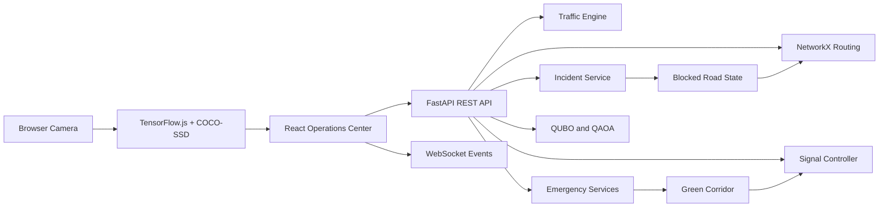

# Q-FLOW

## Quantum-Assisted Smart Traffic and Emergency Routing

Q-FLOW is an intelligent metropolitan traffic-control and emergency-response platform. It combines camera-based traffic detection, adaptive traffic signals, graph-based routing, QUBO/QAOA optimization, pedestrian safety, accident-aware rerouting, and ambulance green corridors.

The goal is simple: help cities move everyday traffic more efficiently while giving emergency vehicles the safest and fastest possible route.

## What It Does

- Simulates traffic across six connected junctions: J1 through J6
- Tracks vehicle queues, traffic density, pedestrians, and signal timing
- Uses browser camera AI to detect vehicles and pedestrians locally
- Adapts green-light timing based on traffic conditions
- Protects pedestrian crossings with clearance phases
- Calculates ambulance routes using NetworkX
- Excludes blocked and closed accident roads from routing
- Activates emergency green corridors
- Tracks ambulance progress and ETA
- Resolves overlapping emergency priorities
- Provides classical and QAOA optimization benchmarks
- Streams traffic, signal, pedestrian, and incident events through WebSockets

## Demo Workflow

1. Open the frontend and select **City Ops**.
2. Use **Traffic optimization** to start or pause the traffic simulation.
3. Switch between `normal`, `congestion`, and `incident` scenarios.
4. Open **Camera AI** and start camera detection.
5. Detected vehicles and pedestrians update the J1 traffic state.
6. Signal timing changes according to density and pedestrian demand.
7. Open **Emergency dispatch** and dispatch an ambulance.
8. Q-FLOW calculates a route and activates a green corridor.
9. Open **Incident lab** and block a road.
10. New emergency routes avoid the blocked road and use a safe bypass.
11. Use **Live map** or **Ambulance tracking** to follow the emergency vehicle.
12. Use **QAOA benchmark** to compare optimization results.

## Architecture



## Technology Stack

### Frontend

- **React 18**: reusable interface components and application state
- **Vite**: development server and production build
- **JavaScript / JSX**: UI behavior, simulation logic, and interactions
- **CSS**: responsive design, Stitch-inspired theme, topology effects, and animations
- **TensorFlow.js**: browser machine-learning runtime
- **COCO-SSD**: vehicle and pedestrian object detection
- **Leaflet**: live route and ambulance map
- **Lucide React**: interface icons
- **Fetch API**: REST communication
- **WebSocket API**: real-time event connection

### Backend

- **Python**: traffic, routing, emergency, and optimization logic
- **FastAPI**: REST endpoints and WebSocket routes
- **Uvicorn**: local ASGI server
- **Pydantic**: validated domain models
- **NetworkX**: road graph and emergency route calculation
- **NumPy**: deterministic traffic simulation
- **Qiskit / Qiskit Aer**: QUBO and QAOA optimization workflows
- **WebSockets**: live system event delivery

### Development and Testing

- VS Code
- GitHub Copilot
- Stitch design export
- npm
- PowerShell
- pytest
- Git

## Project Structure

```text
HACK-HERE-HACKATHON/
├── backend/
│   ├── app/
│   │   ├── api/              # FastAPI route modules
│   │   ├── models/           # Pydantic domain models
│   │   ├── optimization/     # QUBO, QAOA, and classical optimization
│   │   ├── services/         # Routing, traffic, emergency, and incident services
│   │   ├── simulation/        # Traffic and signal simulation engines
│   │   └── websocket/         # Real-time event manager
│   ├── requirements.txt
│   └── run.py
├── frontend/
│   ├── src/
│   │   ├── components/       # Dashboard, map, camera, and tracking views
│   │   ├── context/           # Shared React state and WebSocket context
│   │   ├── services/          # REST and WebSocket clients
│   │   └── utils/             # Constants and frontend helpers
│   ├── package.json
│   └── vite.config.js
├── docs/
│   ├── Q_FLOW_TECHNICAL_OVERVIEW.md
│   └── Q_FLOW_TECHNICAL_OVERVIEW.rtf
└── README.md
```

## Local Setup

### 1. Start the backend

Open PowerShell:

```powershell
cd C:\Users\nethi\OneDrive\Documents\HACK-HERE-HACKATHON\backend
python -m pip install -r requirements.txt
python run.py
```

Backend URLs:

- API: http://127.0.0.1:8000/
- Health check: http://127.0.0.1:8000/health
- Swagger API docs: http://127.0.0.1:8000/docs
- WebSocket: ws://localhost:8000/ws
- Traffic WebSocket: ws://localhost:8000/ws/traffic

### 2. Start the frontend

Open a second PowerShell window:

```powershell
cd C:\Users\nethi\OneDrive\Documents\HACK-HERE-HACKATHON\frontend
npm install
npm run dev
```

Frontend URL:

http://127.0.0.1:5173/

The frontend is configured to use:

```text
REST API: http://localhost:8000
WebSocket: ws://localhost:8000/ws
```

### 3. Run the backend tests

```powershell
cd C:\Users\nethi\OneDrive\Documents\HACK-HERE-HACKATHON\backend
python -m pytest -q
```

The current regression suite has been verified with 120 passing tests.

### 4. Build the frontend

```powershell
cd C:\Users\nethi\OneDrive\Documents\HACK-HERE-HACKATHON\frontend
npm run build
```

## Important API Endpoints

```text
GET  /health
GET  /api/traffic
GET  /api/traffic/junctions
GET  /api/traffic/roads
POST /api/emergencies
GET  /api/emergencies/{emergency_id}/route
POST /api/incidents
GET  /api/metrics
GET  /api/optimization/classical
WS   /ws
WS   /ws/traffic
```

## How the Core Logic Works

### Adaptive traffic signals

```text
Traffic density increases -> green duration increases
Pedestrian count increases -> pedestrian clearance phase
Ambulance route activates -> emergency priority green
Accident occurs -> affected road becomes BLOCKED
```

### Emergency routing

1. Create an emergency request.
2. Assign an available ambulance.
3. Calculate a route through the traffic graph.
4. Exclude roads marked `BLOCKED` or `CLOSED`.
5. Activate signal priority along the selected route.
6. Track the ambulance through the route.
7. Release the corridor when the emergency is complete.

### Camera processing

Camera frames are analyzed locally in the browser:

```text
Camera frame -> COCO-SSD detection -> vehicle/pedestrian counts
             -> J1 queue and density update -> signal timing display
```

The prototype does not upload camera video to the backend.

## Connection Troubleshooting

If the dashboard shows **API Unavailable** or **WS Offline**:

1. Confirm the backend terminal is running `python run.py`.
2. Open http://127.0.0.1:8000/health and confirm it returns `{"ok":true}`.
3. Confirm the frontend is running with `npm run dev`.
4. Open http://127.0.0.1:5173/.
5. Refresh the browser.
6. Click **Sync Telemetry**.

The backend includes CORS permissions for both:

```text
http://localhost:5173
http://127.0.0.1:5173
```

Camera detection requires `localhost`, `127.0.0.1`, or HTTPS and requires browser camera permission.

## Validation Status

- Backend regression suite: **120 tests passed**
- Frontend production build: **passed**
- Backend health endpoint: **HTTP 200**
- Traffic API: **HTTP 200**
- Emergency API: **HTTP 200**
- CORS preflight: **verified**
- Ambulance route integration: **fixed and verified**
- Accident route blocking: **implemented and tested**

## Current Prototype Limitation

Camera detections currently update the frontend simulation state directly. A production deployment should add a telemetry endpoint such as:

```text
POST /api/telemetry/junctions/{junction_id}
```

That endpoint could persist camera telemetry, run the backend signal optimizer, and broadcast updated signal configurations to all connected dashboard clients.

## Documentation

For the detailed technical explanation, see:

- [Technical Overview](docs/Q_FLOW_TECHNICAL_OVERVIEW.md)
- [Word-compatible Technical Overview](docs/Q_FLOW_TECHNICAL_OVERVIEW.rtf)

## License

This project was created as a hackathon prototype.
