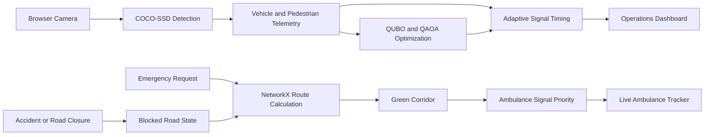

# Q-FLOW Technical Overview

## 1. Project Summary

Q-FLOW is an adaptive metropolitan traffic and emergency-response platform. It combines camera-based traffic detection, dynamic signal timing, graph-based routing, quantum-inspired optimization, and ambulance green corridors.

The platform is designed to help cities:

- Reduce traffic congestion
- Adapt signal timing to vehicle density
- Protect pedestrian crossings
- Prioritize ambulances
- Avoid accident-blocked roads
- Track emergency vehicles in real time
- Compare classical and QAOA-based optimization

## 2. Core Workflow



## 3. Implemented Features

### 3.1 Traffic Simulation

The operations center simulates:

- Vehicle queue length
- Vehicle density
- Pedestrian counts
- Congestion scenarios
- Incident scenarios
- Network simulation ticks
- Signal phase changes
- Adaptive green duration

The user can pause, resume, and switch between normal, congestion, and incident scenarios.

### 3.2 Multi-Intersection Network

The demo network contains six connected junctions:

```text
J1 ----- J2 ----- J3
 |    /   |   \    |
J4 ----- J5 ----- J6
```

Each junction can display:

- Queue length
- Road capacity
- Vehicle density
- Pedestrian count
- Signal phase
- Green-light duration
- Emergency corridor status

The frontend also includes a generative topology visualization with animated junction nodes and signal pulses.

### 3.3 Camera AI

The Camera AI tab uses the browser camera and COCO-SSD object detection.

It detects:

- Cars
- Trucks
- Buses
- Motorcycles
- Bicycles
- Pedestrians

Detection occurs locally in the browser. No camera video is uploaded to the backend.

Detected counts are connected to the J1 simulation state:

```text
Camera detection
    -> vehicle and pedestrian counts
    -> queue and density update
    -> signal timing recalculation
    -> operations dashboard update
```

Telemetry updates are throttled to avoid excessive UI updates.

### 3.4 Adaptive Signal Timing

Signal timing follows these rules:

- Normal traffic uses a standard adaptive green duration.
- High vehicle density increases the green duration.
- High queue length increases the green duration.
- Active pedestrian demand switches the junction to pedestrian clearance.
- Ambulance corridor junctions receive emergency priority.
- Emergency corridor junctions use a longer protected green phase.

The backend includes a classical signal optimizer that evaluates queue length, density, pedestrian crossings, and emergency reservations.

### 3.5 Ambulance Dispatch

The ambulance workflow is:

```text
Create emergency request
    -> Calculate emergency route
    -> Exclude blocked and closed roads
    -> Activate green corridor
    -> Reserve signals along the route
    -> Track ambulance movement
```

The ambulance tracker displays:

- Ambulance ID
- Current route
- Current junction
- Speed
- Distance traveled
- Estimated time of arrival
- Corridor state
- Arrival status

### 3.6 Accident and Road Closure Handling

When an accident is created:

1. The incident service validates the road.
2. The road status changes to `BLOCKED`.
3. Traffic flow on the road stops.
4. Travel time becomes unavailable or extremely high.
5. New routes exclude the blocked road.
6. Emergency traffic uses a valid bypass when available.
7. Incident events are emitted through WebSocket channels.

Road closures use the `CLOSED` state and follow the same route-exclusion behavior.

### 3.7 WebSocket Events

The backend provides WebSocket endpoints for live events:

```text
ws://localhost:8000/ws
ws://localhost:8000/ws/traffic
```

Events include:

- Traffic updates
- Signal updates
- Incident creation and updates
- Pedestrian updates
- Emergency creation and updates
- Ambulance events
- Green corridor events
- Route impact events

### 3.8 QUBO and QAOA Optimization

The optimization layer supports:

- QUBO problem formulation
- Classical baseline optimization
- QAOA execution
- Signal phase allocation
- Emergency route evaluation
- Quantum versus classical benchmark display

The demo uses Qiskit and Qiskit Aer for quantum optimization workflows and NetworkX for graph routing.

### 3.9 Frontend Navigation and Design

The frontend includes:

- Network Graph
- City Ops
- Impact ROI
- Traffic optimization
- Live map
- Ambulance tracking
- Camera AI
- Emergency dispatch
- QAOA benchmark
- Incident lab

The visual system is inspired by the Stitch design export and uses:

- Limestone canvas
- Editorial typography
- Charcoal text
- Electric blue and cyan accents
- Compact square controls
- Hairline grid backgrounds
- Animated topology graph
- Telemetry ribbon
- Hover lift effects
- Page-load reveals
- Signal pulse animations
- Green corridor glow
- Reduced-motion accessibility handling

## 4. Technology Stack

### Frontend

- React 18
- Vite
- JavaScript and JSX
- CSS
- Lucide React
- TensorFlow.js
- COCO-SSD
- Leaflet
- Fetch API
- WebSocket client

### Backend

- Python
- FastAPI
- Uvicorn
- Pydantic
- NetworkX
- NumPy
- Qiskit
- Qiskit Aer
- WebSockets

### Testing and Development

- pytest
- npm
- Vite production build
- PowerShell
- VS Code
- GitHub Copilot
- Stitch design export
- Git

## 5. Repository Structure

```text
HACK-HERE-HACKATHON/
├── backend/
│   ├── app/
│   │   ├── api/
│   │   ├── models/
│   │   ├── optimization/
│   │   ├── services/
│   │   ├── simulation/
│   │   └── websocket/
│   ├── requirements.txt
│   └── run.py
├── frontend/
│   ├── src/
│   │   ├── components/
│   │   ├── context/
│   │   ├── services/
│   │   └── utils/
│   ├── package.json
│   └── vite.config.js
└── docs/
    └── Q_FLOW_TECHNICAL_OVERVIEW.md
```

## 6. Important Backend Services

| Service | Responsibility |
|---|---|
| `traffic_service.py` | Coordinates traffic simulation and network state |
| `traffic_engine.py` | Calculates flow, density, queues, and travel time |
| `routing_service.py` | Generates route candidates while excluding blocked roads |
| `emergency_routing_service.py` | Calculates emergency routes on the live traffic network |
| `emergency_service.py` | Coordinates emergency requests, assignments, and routes |
| `incident_service.py` | Creates incidents and changes road status |
| `signal_engine.py` | Validates and applies signal configurations |
| `green_corridor_service.py` | Plans and activates emergency green corridors |
| `ambulance_assignment_service.py` | Assigns and releases ambulances |
| `emergency_conflict_resolution_service.py` | Resolves overlapping emergency routes |
| `classical.py` | Produces adaptive classical signal configurations |
| `qubo_formulation.py` | Builds route optimization problems |
| `qaoa_execution.py` | Executes QAOA optimization workflows |

## 7. Important Frontend Components

| Component | Responsibility |
|---|---|
| `OperationsCenter.jsx` | Main simulation dashboard and workflow coordinator |
| `CameraDetection.jsx` | Browser camera and COCO-SSD detection |
| `LiveMap.jsx` | Visual route and ambulance map |
| `AmbulanceTracking.jsx` | Ambulance movement and status display |
| `ConnectionStatus.jsx` | API and WebSocket status indicators |
| `Navbar.jsx` | Main navigation and simulator controls |
| `HeroSection.jsx` | Landing experience and generative network graph |
| `api.js` | REST API client |
| `websocket.js` | WebSocket connection manager |
| `AppContext.jsx` | Shared application state |
| `WebSocketContext.jsx` | WebSocket provider and event handling |

## 8. Running the Project Locally

### Start the backend

```powershell
cd C:\Users\nethi\OneDrive\Documents\HACK-HERE-HACKATHON\backend
python run.py
```

Backend URLs:

```text
http://127.0.0.1:8000/
http://127.0.0.1:8000/health
http://127.0.0.1:8000/docs
```

### Start the frontend

```powershell
cd C:\Users\nethi\OneDrive\Documents\HACK-HERE-HACKATHON\frontend
npm install
npm run dev
```

Frontend URL:

```text
http://127.0.0.1:5173/
```

### Verify the backend

```powershell
cd C:\Users\nethi\OneDrive\Documents\HACK-HERE-HACKATHON\backend
python -m pytest -q
```

Current regression result:

```text
120 passed
```

## 9. Connection Requirements

The frontend expects:

```text
REST API: http://localhost:8000
WebSocket: ws://localhost:8000/ws
```

The backend includes CORS permissions for:

```text
http://localhost:5173
http://127.0.0.1:5173
```

If the dashboard shows API unavailable or WebSocket offline:

1. Start the backend with `python run.py`.
2. Start the frontend with `npm run dev`.
3. Open `http://127.0.0.1:5173/`.
4. Refresh the browser.
5. Click `Sync Telemetry`.

## 10. Validation Status

Completed validation includes:

- Backend regression suite: 120 tests passed.
- Frontend production build: passed.
- Backend health endpoint: HTTP 200.
- Traffic API endpoint: HTTP 200.
- Emergency API endpoint: HTTP 200.
- CORS preflight response: verified.
- Ambulance dispatch route integration: fixed and compiled.
- Accident route blocking and emergency rerouting: tested through backend workflows.

## 11. Current Limitation and Next Production Step

The camera-to-signal demonstration currently updates the frontend simulation state directly. The backend already supports traffic, signal, pedestrian, incident, routing, and emergency models.

For a production deployment, add a telemetry endpoint such as:

```text
POST /api/telemetry/junctions/{junction_id}
```

The frontend would send detected vehicle and pedestrian counts to that endpoint. The backend could then persist the data, run the signal optimizer, broadcast the result through WebSockets, and coordinate multiple camera sources consistently.
